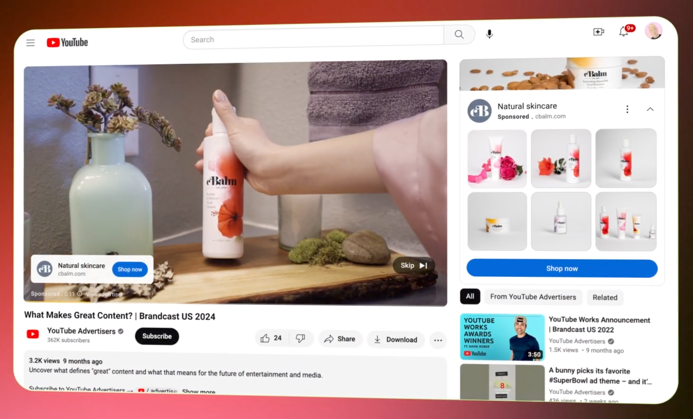
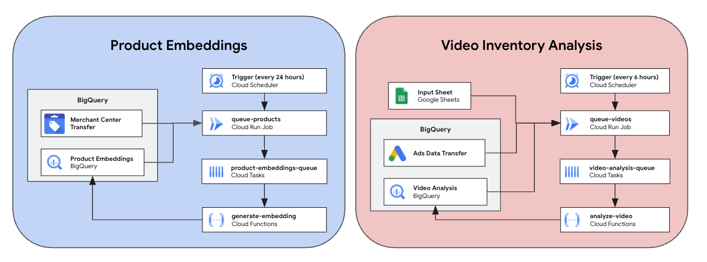

# Shoppable Video Accelerator

## Overview

**Turn your video ads into virtual storefronts with the Shoppable Video Accelerator.**

Enhancing [Demand Gen campaigns with Product
Feeds](https://support.google.com/google-ads/answer/13721750?hl=en)
drives more conversions, but for large retailers, manually tagging videos with
relevant products can be time-consuming and difficult to do at scale.



Using Gemini, Google's AI, to intelligently map products to your video
creative, this tool automatically identifies relevant merchandise within video
content to ensure accurate and engaging ad placements.

This is achieved by:

1) Identifying the products that are being advertised in each video
2) Finding products sold by the retailer similar to those identified
in the video
3) Adding these products to the respective campaigns in Google Ads

## Features

* **Automated Product Identification:** No need to scan video ads manually to
find your advertised products. Gemini watches the video for you and logs product
appearances.

* **Google Merchant Center Integration:** Retrieves your product data directly
from Google Merchant Center via the [Merchant Center BigQuery
Data Transfer](https://cloud.google.com/bigquery/docs/merchant-center-transfer).

* **Semantic Matching**: Uses Vector Search & Embeddings to match identified
products to the specific SKUs in your inventory.

* **Scalable Cloud Architecture**: Built using Google Cloud to handle thousands
of videos and millions of products.

* **Structured Data**: Outputs clean, structured data back into BigQuery, ready
for further analysis and campaign integration.

## How it works

For a deeper dive into the solution, please see the
[Solution Designsection](#solution-design).

There are three key steps to adding products to your Demand Gen video campaigns:

### Identifying the products that are being advertised in each video

Using Gemini's multimodal functionality, this solution analyzes your video
creative, sourced from **public** YouTube videos or a set of provided Cloud
Storage locations, and identifies advertised products and their features. This
data is then stored in BigQuery for later use.

> [!NOTE]
> Gemini can only access YouTube videos that are set to **Public**. Private or
Unlisted videos will be automatically skipped by the processing pipeline. For
non-public videos, we recommend uploading video files to Google Cloud Storage
and using the GCS sourcing option.

### Finding products similar to those identified in the video

To discover the most relevant products and enable intelligent matching, this
solution leverages **embeddings and vector search**.

**What are Embeddings?** Embeddings are numerical representations of information
(like text descriptions or product attributes) that capture their semantic
meaning.

Think of it like assigning a unique "digital fingerprint" to each
product based on its characteristics. Products that are similar in meaning or
content will have fingerprints that are numerically close to each other.

In this solution, features like a product's title, description, and other
attributes are converted into these numerical vectors using an embedding model.

**How does Vector Search work?** [Vector
Search](https://cloud.google.com/vertex-ai/docs/matching-engine/overview)
(sometimes called Approximate Nearest Neighbor or ANN) is a technique that
efficiently finds the "closest" or most similar embeddings to a given query
embedding.

By storing all your product embeddings in a searchable database, the system can
quickly and intelligently identify which products from your Merchant Center
catalog are most similar to products detected within your video content.

### Adding these products to their respective campaigns in Google Ads

The output from this data pipeline is a set of matched products and their
"distance" (or how similar they are) to the identified products in each video.

Using the provided web app (in development), you can audit the output of the
solution, approve/disapprove matched products, and easily push those products to
Google Ads campaigns & ad groups.

## **Deployment Modes**

Shoppable Video Accelerator offers two deployment modes:

1. **Pipeline Only (Available):** Deploys the core data pipeline, including
product embedding generation, video analysis, and product mapping in BigQuery.
This mode is suitable for users who want to process data and access results
directly in BigQuery.

2. **Pipeline + Webapp (In Development):** Deploys the core data pipeline along
with a web application for auditing and managing matched products.

> [!WARNING]
> The web application is currently **in development** and is not recommended for
production use. We recommend deploying the **Pipeline Only** mode (default) at
this time.

## Installation

This section outlines the steps to install and configure Shoppable Video
Accelerator.

### Requirements

To use Shoppable Video Accelerator, you'll need the following:

* A [Google Cloud project](https://console.cloud.google.com) with billing
    enabled.
* [Terraform](https://developer.hashicorp.com/terraform/tutorials/gcp-get-started/install-cli),
    installed on your local machine or Cloud Shell.
* [Google Cloud SDK (gcloud CLI)](https://cloud.google.com/sdk/docs/install),
    installed and [configured](https://cloud.google.com/sdk/docs/initializing).
* Access to a [Google Merchant Center](https://business.google.com/us/merchant-center/)
    account, specifically for setting up the [Merchant Center Transfer in
    BigQuery](https://cloud.google.com/bigquery/docs/merchant-center-transfer).
* \[Optional\] Access to a Google Ads account, specifically for setting up the
    [Google Ads Data Transfer in BigQuery](https://docs.cloud.google.com/bigquery/docs/google-ads-transfer)
* \[Optional\] [Node.js and npm](https://docs.npmjs.com/downloading-and-installing-node-js-and-npm)
    installed, specifically if you intend to deploy the web application.

Shoppable Video Accelerator uses
[Terraform](https://developer.hashicorp.com/terraform/tutorials/gcp-get-started/infrastructure-as-code)
to automate the deployment of resources on Google Cloud Platform, streamlining
the setup process.

#### **Google Cloud Platform Services and APIs**

> [!IMPORTANT]
> Terraform will automatically enable most of these APIs during installation.
However, the **Cloud Resource Manager** and **Service Usage** APIs must be
enabled manually before running Terraform (see step 2 below).

* **Core Services:**
  * [IAM (Identity and Access Management)](https://cloud.google.com/iam/docs/overview) (iam.googleapis.com)
  * [API Keys](https://cloud.google.com/docs/authentication/api-keys) (apikeys.googleapis.com)
  * [Service Usage API](https://cloud.google.com/service-usage/docs/overview) (serviceusage.googleapis.com)
  * [Cloud Resource Manager API](https://cloud.google.com/resource-manager/docs/overview) (cloudresourcemanager.googleapis.com)
* **Development and Deployment:**
  * [Cloud Build API](https://cloud.google.com/cloud-build/docs/overview) (cloudbuild.googleapis.com)
  * [Artifact Registry API](https://cloud.google.com/artifact-registry/docs/overview) (artifactregistry.googleapis.com)
* **Serverless Compute and Task Management:**
  * [Cloud Functions API](https://cloud.google.com/functions/docs/overview) (cloudfunctions.googleapis.com)
  * [Cloud Run API](https://cloud.google.com/run/docs/overview) (run.googleapis.com)
  * [Cloud Scheduler API](https://cloud.google.com/scheduler/docs) (cloudscheduler.googleapis.com)
  * [Cloud Tasks API](https://cloud.google.com/tasks/docs) (cloudtasks.googleapis.com)
* **Data and Analytics:**
  * [BigQuery API](https://cloud.google.com/bigquery/docs) (bigquery.googleapis.com)
  * [BigQuery Data Transfer Service API](https://cloud.google.com/bigquery/docs/merchant-center-transfer) (bigquerydatatransfer.googleapis.com)
  * [Google Sheets API](https://developers.google.com/sheets/api/overview) (sheets.googleapis.com)
  * [Cloud Storage API](https://cloud.google.com/storage) (storage.googleapis.com)
  * [YouTube Data API](https://developers.google.com/youtube/v3) (youtube.googleapis.com)
* **Artificial Intelligence and Machine Learning:**
  * [Generative Language API](https://ai.google.dev/gemini-api/docs) (generativelanguage.googleapis.com)
  * [Vertex AI API](https://cloud.google.com/vertex-ai/docs/start/overview-key-concepts) (aiplatform.googleapis.com)
* **Security:**
  * [Secret Manager API](https://cloud.google.com/security/products/secret-manager) (secretmanager.googleapis.com)
  * [Certificate Manager API](https://cloud.google.com/certificate-manager/docs/overview) (certificatemanager.googleapis.com)
  * [Identity-Aware Proxy API](https://cloud.google.com/iap/docs/overview) (iap.googleapis.com)
* **Networking:**
  * [Compute Engine API](https://cloud.google.com/compute/docs) (compute.googleapis.com)
  * [Cloud DNS API](https://cloud.google.com/dns/docs/overview) (dns.googleapis.com)
  * [Cloud VPC Access API](https://cloud.google.com/vpc/docs/configure-serverless-vpc-access) (vpcaccess.googleapis.com)

#### **Service Account**

The solution will create a service account with the following permissions:

* [roles/bigquery.dataOwner](https://cloud.google.com/bigquery/docs/access-control#bigquery.dataOwner)
* [roles/bigquery.jobUser](https://cloud.google.com/bigquery/docs/access-control#bigquery.jobUser)
* [roles/cloudtasks.enqueuer](https://docs.cloud.google.com/tasks/docs/access-control#cloudtasks.enqueuer)
* [roles/cloudtasks.viewer](https://cloud.google.com/tasks/docs/access-control#cloudtasks.viewer)
* [roles/iam.serviceAccountOpenIdTokenCreator](https://docs.cloud.google.com/iam/docs/roles-permissions/iam#iam.serviceAccountOpenIdTokenCreator)
* [roles/iam.serviceAccountUser](https://docs.cloud.google.com/iam/docs/roles-permissions/iam#iam.serviceAccountUser)
* [roles/logging.logWriter](https://cloud.google.com/logging/docs/access-control#logging.logWriter)
* [roles/run.invoker](https://docs.cloud.google.com/run/docs/reference/iam/roles#run.invoker)
* [roles/secretmanager.viewer](https://cloud.google.com/secret-manager/docs/access-control#secretmanager.viewer)
* [roles/storage.objectViewer](https://cloud.google.com/storage/docs/access-control/iam-roles#storage.objectViewer)
* [roles/aiplatform.user](https://cloud.google.com/vertex-ai/docs/general/access-control#aiplatform.user)

### Video Sourcing Options

Shoppable Video Accelerator can ingest videos from two sources. You can
configure one or both of these options via Terraform variables:

> [!WARNING]
> Gemini can only access YouTube videos that are set to **Public**. Private or
Unlisted videos will be automatically skipped by the pipeline. For non-public
videos, you must upload the files to Google Cloud Storage and use the GCS
sourcing option.

#### Option 1. Google Ads Data Transfer (Recommended)

Automatically pulls YouTube videos from your existing Google Ads Demand Gen
campaigns.

* **Prerequisite:** You must have the [Google Ads Data Transfer](https://cloud.google.com/bigquery/docs/google-ads-transfer)
set up in BigQuery.
* **Configuration:** Set the `ads_customer_id` variable to your Google Ads Customer ID.

#### Option 2. Google Sheet

Allows you to manually specify a list of YouTube Video IDs or Google Cloud
Storage (GCS) URIs.

* **Configuration:** Set the `spreadsheet_id` variable.
* **Permissions:** You must share the Google Sheet with the
**Service Account email** created by Terraform (e.g.,
`shoppable-video-sa@your-project.iam.gserviceaccount.com`).
* **Format:** The Google Sheet must contain two specific tabs:
  * **`VideoIDs`**: List YouTube Video IDs in column A, starting from row 2 (row 1 should be a "video_id" header).
  * **`GCS`**: List GCS URIs (e.g., `gs://my-bucket/video.mp4` or `gs://my-bucket/videos/`) in column A, starting from row 2 (row 1 should be a "GCS URI" header).

### Installation Steps

Follow these steps to install and deploy Shoppable Video Accelerator:

#### 1. Clone the Repository

Clone the repository using Cloud Shell or your local machine.

```bash
git clone https://github.com/google-marketing-solutions/shoppable-video.git
```

#### 2. Enable APIs & Access in your Google Cloud Project

Before deploying, ensure the following APIs are enabled in your Google Cloud
project:

* [Cloud Resource Manager
    API](https://console.cloud.google.com/apis/library/cloudresourcemanager.googleapis.com)
    (cloudresourcemanager.googleapis.com)
* [Service Usage
    API](https://console.cloud.google.com/apis/library/serviceusage.googleapis.com)
    (serviceusage.googleapis.com)

All other APIs will be enabled automatically by Terraform.

If you are running Terraform as a human user, ensure that you have the
appropriate BigQuery role (either bigquery.dataOwner or bigquery.dataEditor). If
you can't apply this role with project-level access, then complete the
instructions until the solution dataset is created (and TF fails), then grant
dataset-level access manually and rerun Terraform.

#### 3. Provide Values for Variables

Create a variables.tfvars file in the terraform/ directory and provide the
following values ([click here for
details](https://developer.hashicorp.com/terraform/language/values/variables#variable-definitions-tfvars-files)). **Only update optional values when required.**

| Group | Variable | Description | Required | Default |
| :--- | :--- | :--- | :--- | :--- |
| **Core** | `project_id` | Google Cloud Project ID | **Yes** | |
| | `location` | [Google Cloud region](https://cloud.withgoogle.com/region-picker) to use. | No | `us-central1` |
| | `service_account` | Name of the service account to create. | **Yes** | |
| | `deploy_webapp` | Whether to deploy the web application (In Development). | No | `false` |
| **Data Sources** | `merchant_id` | Google Merchant Center ID. | **Yes** | |
| | `ads_customer_id` | Google Ads Customer ID for YouTube video sourcing. | No | `null` |
| | `spreadsheet_id` | Google Sheet ID for manual video/GCS URI sourcing. | No | `null` |
| **Pipeline Tuning** | `refresh_window_days` | Lookback window (days) for new products and videos. | No | `7` |
| | `number_of_matched_products` | Top matching products to retrieve for each video. | No | `10` |
| | `product_limit` | Number of products to process per batch. | No | `1000` |
| | `video_limit` | Number of videos to process per batch. | No | `10` |
| **AI & Models** | `generative_model_name` | [Gemini model](https://ai.google.dev/gemini-api/docs/models#model-variations) for video analysis. | No | `gemini-2.5-flash` |
| | `embedding_model_name` | Model for generating product embeddings. | No | `gemini-embedding-001` |
| | `vector_search_embedding_dimensions` | Dimensions for the embedding vectors. | No | `1536` |
| **Infrastructure** | `bigquery_dataset_id` | Name of the BigQuery dataset to create. | No | `shoppable_video` |
| | `repository_id` | ID of the Artifact Registry repository. | No | `shoppable-video` |
| | `gcs_embeddings_bucket_name` | GCS bucket name to store embeddings. | No | `shoppable-video-embeddings` |
| | `gcs_bucket_ttl_days` | Days after which to delete objects in the bucket. | No | `90` |

**Example terraform/variables.tfvars file:**

```text
# Core Settings
project_id      = "your-gcp-project-id"
location        = "us-central1"
service_account = "shoppable-video-sa"
deploy_webapp   = false

# Data Sources
merchant_id     = "123456789"
ads_customer_id = "1234567890"
spreadsheet_id  = "your-spreadsheet-id"

# Pipeline Tuning
refresh_window_days        = "14"
number_of_matched_products = 5
product_limit              = 500
video_limit                = 20

# AI Models
generative_model_name              = "gemini-2.5-flash"
embedding_model_name               = "gemini-embedding-001"
vector_search_embedding_dimensions = 1536

# Infrastructure
bigquery_dataset_id        = "my_shoppable_video_dataset"
repository_id              = "my-shoppable-video-repo"
gcs_embeddings_bucket_name = "my-shoppable-video-embeddings"
gcs_bucket_ttl_days        = 120
```

#### 4. Deploy Shoppable Video Accelerator

To deploy Shoppable Video Accelerator using Terraform, run the following
commands:

> \[\!WARNING\] If you are running Terraform using Cloud Shell, you may need to
> update Terraform to at least v1.11
>
> Follow the
> [instructions](https://developer.hashicorp.com/terraform/install#linux) (or
> run this command from the docs below in your terminal.)
>
> ```bash
> wget -O - <https://apt.releases.hashicorp.com/gpg> | sudo gpg --dearmor -o /usr/share/keyrings/hashicorp-archive-keyring.gpg
> echo "deb [arch=$(dpkg --print-architecture) signed-by=/usr/share/keyrings/hashicorp-archive-keyring.gpg] https://apt.releases.hashicorp.com $(lsb_release -cs) main" | sudo tee /etc/apt/sources.list.d/hashicorp.list
> sudo apt update && sudo apt install terraform
> ```

First, initialize the Terraform configuration:

`terraform init`

Then, apply the Terraform configuration. This will display the changes to be
applied and prompt you for confirmation:

`terraform apply -var-file=variables.tfvars`

Type `yes` and press Enter to confirm the deployment.

> \[\!IMPORTANT\] Terraform will try to set up the Merchant Center Transfer
> using the credentials of the newly created service account. In order to get
> the transfer to succeed, you will need to either
>
> * [Grant the service
>     account](https://support.google.com/merchants/answer/12160472)
>     "Performance and insights" access in Merchant Center.
> * Replace the service account with a human user who has access to
>     Merchant Center.
>   * Go to BigQuery \> Data Transfers \> merchant\_center\_transfer \>
>         Configuration
>   * Click "Update Credentials"
>
> If this is your first time using the Merchant Center Transfer, your `terraform
> apply` might fail with a "table not found" error. It can take up to 24 hours
> for the Merchant Center transfer table to become available. Once the transfer
> succeeds and the table exists in BigQuery, run the apply command again.

Lastly, you will need to enable the two newly-created Cloud Scheduler jobs.
(Terraform sets the jobs to `PAUSED` to prevent the solution from running
inadvertently.)

To enable the jobs:

1. Navigate to **Cloud Scheduler** in the Google Cloud Console.
2. Find the jobs named `scheduled-queue-products` and `scheduled-queue-videos`.
3. For each job, click the toggle in the "State" column to change it from
    "Paused" to "Enabled".

You can also force a manual run of the job to check if everything is working as
expected; look at Cloud Logging or the output BQ table. To force a manual run:

1. In the Cloud Scheduler page, click on the job you want to run
    (`queue-products-job` or `scheduled-queue-videos`).
2. Click the **"Force run"** button at the top of the page.

Alternatively, you can use the `gcloud` CLI:

To enable a job:

```bash
gcloud scheduler jobs enable scheduled-queue-products --project=[YOUR_PROJECT_ID]
gcloud scheduler jobs enable scheduled-queue-videos --project=[YOUR_PROJECT_ID]
```

To force a manual run:

```bash
gcloud scheduler jobs run scheduled-queue-products --project=[YOUR_PROJECT_ID]
gcloud scheduler jobs run scheduled-queue-videos --project=[YOUR_PROJECT_ID]
```

## Destroy Deployed Resources

To remove all Shoppable Video Accelerator resources from your Google Cloud
project, run the following command from the terraform/ directory:

`terraform destroy -var-file=variables.tfvars`

Type `yes` and press Enter to confirm the deletion of all deployed resources.

## Solution Design



### Product Embeddings

1. On a scheduled basis (daily by default), the **Queue Products** Cloud Run
    job:
    1. Queries BigQuery to identify the set of products from Merchant Center
        that do not yet have an embedding.
    2. Pushes new products to the **`product-embeddings-queue`** in Cloud
        Tasks.
2. Cloud Tasks orchestrates a call to the **Generate Embedding** Cloud Function
    for each product.
3. The **Generate Embedding** function:
    1. Gets the text to embed based on the product's title, description, and
        other attributes.
    2. Makes an HTTP request to Gemini's `embedContent` endpoint which returns
        an embedding vector.
    3. Writes the embedding to the `product_embeddings` table in BigQuery.

Here is an example of the text used to generate an embedding for a product from
Merchant Center:

```text
Title: Google Pixel 10
Brand: Google
Product Category: Electronics > Communications > Telephony > Mobile Phones
Product Type: Mobile Phones
Color: Obsidian
Description: The Google Pixel 10 is the latest smartphone from Google, featuring
a powerful new processor, a stunning display, and an advanced camera system.
```

### Video Inventory Analysis

1. On a scheduled basis (every 6 hours by default), the **Queue Videos** Cloud
    Run job:
    1. Executes queries to retrieve the set of unprocessed videos from:
        1. Google Ads (via Google Ads BigQuery Data Transfer)
        2. From a user-provided Google Sheet which can contain either Youtube
            Video IDs (e.g.
            [`dQw4w9WgXcQ`](https://www.youtube.com/watch?v=dQw4w9WgXcQ)) or
            Cloud Storage URIs (e.g. `gs://bucket_name/dir/file`)
    2. Filters out any videos that have already been processed by checking
        against the `video_analysis` table in BigQuery.
    3. Pushes new videos to the **`video-analysis-queue`** in Cloud Tasks.
2. Cloud Tasks orchestrates a call to the **Analyze Video** Cloud Function for
    each video.
3. The **Analyze Video** function:
    1. Temporarily uploads the video file (for GCS URIs) to the Gemini File API
        or uses the URL directly for Youtube videos.
    2. Makes an API call to Gemini's multimodal model to identify the relevant
        products and details in the video.
    3. Generates an embedding for each identified product.
    4. Writes the set of identified products to the `video_analysis` table in
        BigQuery.

Here is an example of the text used to generate an embedding for a product
identified in a video:

```text
Title: Black-colored Smartphone with Advanced Camera
Description: A sleek, black-colored smartphone with a large edge-to-edge display
and a prominent module on the rear housing multiple camera lenses.
Color, Pattern, Style, Usage: Matte black finish, minimalist style, used for
capturing high-quality photographs.
Category: Electronics
Subcategory: Mobile Phones
```

### Product / Video Mapping

A BigQuery table (`matched_products`) is materialized by a scheduled query to
join the embeddings of products identified in videos with the most similar
products from Merchant Center.

1. A scheduled query runs periodically (every 24 hours by default) to find
    newly identified products from video analysis that have not yet been mapped.
2. For each identified product, the query uses the `VECTOR_SEARCH` function in
    BigQuery to find the most similar products from the `product_embeddings`
    table.
3. The `VECTOR_SEARCH` function calculates the distance between the embedding
    of the identified product and the embeddings of all the products in Merchant
    Center.
4. The `top_k` (configurable, default is 10) products with the smallest
    distance (i.e., the most similar products) are stored in the
    `matched_products` table for each identified product.

## Cloud Costs

The primary cost drivers for Shoppable Video Accelerator are:

* **Vertex AI / Gemini API:**
  * **Multimodal Analysis:** Analyzing video content with Gemini (e.g.,
  `gemini-2.5-flash`) incurs costs based on the number of input tokens (video
  duration/frames) and output tokens.
  * **Embeddings:** Generating numerical vectors for products and identified
  products via the `embedContent` endpoint.
* **BigQuery:**
  * **Storage:** Costs for storing product data, video analysis results, and
  matched product tables.
  * **Vector Search:** Running the `VECTOR_SEARCH` function to match identified
  products with your inventory. This is billed based on the amount of data
  processed during the search.
  * **Data Transfers:** Standard BigQuery Data Transfer Service storage costs
  apply for Merchant Center and Google Ads integrations.
* **Compute (Cloud Functions & Cloud Run):**
  * Billed based on the execution time and resources (CPU/Memory) used by the
  queuing jobs and analysis functions.
* **Networking (Optional Webapp):**
  * If `deploy_webapp` is enabled, costs include a Global External IP address,
  Load Balancer usage, and potential data egress.

Costs scale directly with the volume of videos analyzed and the number of
products in your Merchant Center catalog. We recommend starting with a small
subset of videos and products to estimate total costs for your specific scale.

## Contributing

See the [contributing guidelines](contributing.md) for details on how to
contribute to this project.

## License

This project is licensed under the Apache 2.0 License.

## Disclaimer

This is not an officially supported Google product. This project is not eligible
for the [Google Open Source Software Vulnerability Rewards
Program](https://bughunters.google.com/open-source-security).